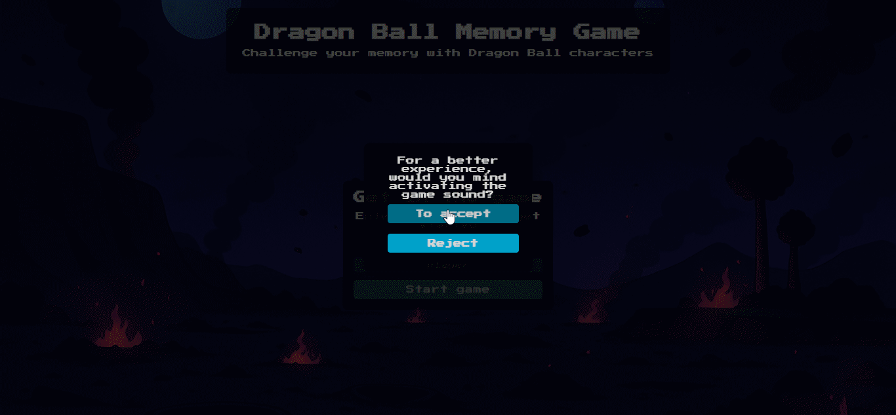
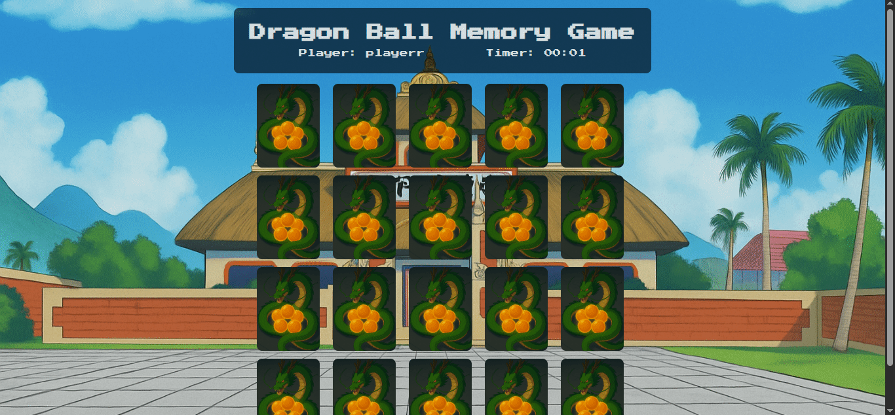
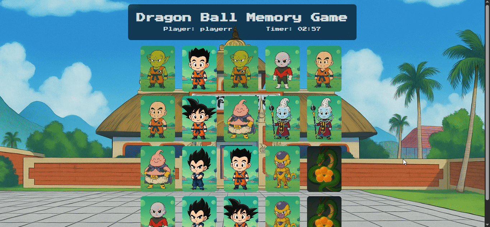

# 🧠 Memory Game – Dragon Ball Edition

Um jogo de memória interativo inspirado no universo Dragon Ball.

O objetivo é combinar pares de cartas com personagens icônicos da série, testando sua memória e agilidade.

## 📌 Índice

- [Descrição](#descrição)
- [Recursos](#recursos)
- [Tecnologias Utilizadas](#tecnologias-utilizadas)
- [Instalação](#instalação)
- [Como Jogar](#como-jogar)
- [Preview do Jogo](#🖼️-preview-do-jogo)
- [Contato](#contato)


## 📝 Descrição

Este projeto é um jogo de memória simples onde o jogador deve encontrar pares de cartas com personagens do Dragon Ball.  

O jogo inclui um cronômetro e uma música de fundo que pode ser ativada ou desativada pelo usuário.


## ⚙️ Recursos

- **Cartas com personagens do Dragon Ball**: Inclui personagens como Goku, Vegeta, Piccolo, entre outros.  
- **Cronômetro**: Mostra o tempo total gasto para completar o jogo.   
- **Música de fundo**: Opção para ativar ou desativar a música durante o jogo.  
- **Tela de vitória**: Exibe o tempo total e o nome do jogador ao vencer.

## 🛠️ Tecnologias Utilizadas
<p align="center">
  
  
  
</p>

- **HTML5**: Estruturação do conteúdo da página.  
- **CSS3**: Estilização interativa.  
- **JavaScript**: Lógica do jogo, manipulação de DOM e controle de áudio.

## 📥 Instalação

Para rodar o jogo localmente você pode escolher **uma das opções abaixo**:

### 🔧 Opção 1 — Clonando o repositório (Git)

```bash
git clone https://github.com/YanSilva22/Memory-Game.git
```
Depois disso, abra o arquivo index.html no seu navegador.

### 📦 Opção 2 — Baixando como ZIP

1. Clique no botão **Code → Download ZIP** aqui no GitHub  
2. Extraia o arquivo `.zip` no seu computador  
3. Abra o arquivo **index.html** no seu navegador

### 🌐 Opção 3 — Jogar online

Você também pode jogar diretamente pelo navegador sem precisar baixar nada.

**Acesse o jogo por este link:** _<link será adicionado aqui>_

## 🎮 Como Jogar

1. Acesse o arquivo `index.html` em seu navegador.  

2. Escolha se deseja ativar a música de fundo do jogo.

3. Digite seu nome de usuário na tela inicial.  

4. Clique em "Iniciar Jogo" para começar.  

5. Clique nas cartas para virá-las e encontrar os pares correspondentes.  

6. Ao encontrar todos os pares, a tela de vitória será exibida com o tempo total.

## 🖼️ Preview do Jogo

> Alguns prints do jogo para você ver como funciona:

  
*Tela inicial onde o usuário escolhe se quer música e digita o nome.*

  
*O tabuleiro do jogo com todas as cartas embaralhadas.*

  
*Tela que aparece ao encontrar todos os pares, mostrando o tempo total e o nome do jogador.*

## 📬 Contato

**Autor:** Yan Silva  
**GitHub:** [https://github.com/YanSilva22](https://github.com/YanSilva22)

> ⚠️ Aviso: Todas as imagens do jogo foram **geradas por Inteligência Artificial**.  
> Este projeto é apenas **para fins educativos e de entretenimento**, sem intenção de infringir direitos autorais.